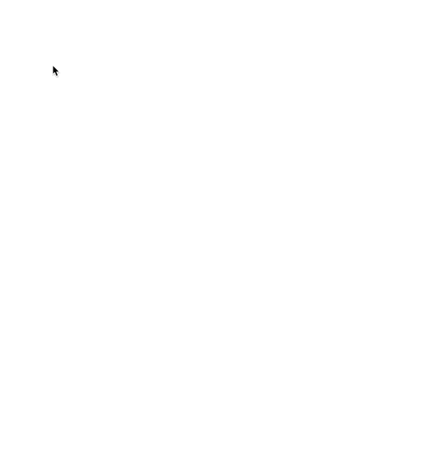

CanvasRenderingContext2D 是 HTML5 Canvas API 中的一個關鍵介面，定義了繪圖上下文（drawing context）和相關的繪圖方法
Day8 使用這個來玩玩繪圖



## 介紹
可到官方閱讀使用方法 [CanvasRenderingContext2D ](https://developer.mozilla.org/en-US/docs/Web/API/CanvasRenderingContext2D)

CanvasRenderingContext2D 是 CanvasRenderingContext 接口的一個實現，使用 HTMLCanvasElement.getContext() 方法，當一個 canvas 元素被創建時，它的內容被設置為一個空白的 bitmap，通過 CanvasRenderingContext2D 的繪圖方法，開發者可以在這個 bitmap 上繪製各種形狀和圖像，然後通過 canvas 元素顯示出來。

## 屬性
```
strokeStyle：線條的顏色或樣式，可以是 CSS 颜色、渐变或图案。
lineWidth：線條的粗细。
lineCap：線條末端的樣式，可以是 butt（平端）、round（圓端）或 square（方端）。
lineJoin：兩條線條相交時的樣式，可以是 round（圓交）, bevel（斜交）或 miter（尖交）。

ctx.beginPath(): 開始一個新的繪圖路徑。
ctx.moveTo(x, y): 移動畫筆到指定的座標(x,y)。這個方法是用來定義線條的起點。
ctx.lineTo(x, y): 添加一條由當前點到指定座標(x,y)的線段。
ctx.stroke(): 畫出當前的線條。
```

### 初步建置
使用常見屬性定義好想要的樣式，用hsl的漸層色增加畫筆顏色變化
```
const canvas = document.querySelector('#draw')

const ctx = canvas.getContext('2d')
canvas.width = window.innerWidth
canvas.height = window.innerHeight

ctx.strokeStyle = '#BADA55'
ctx.lineJoin = 'round'
ctx.lineCap = 'round'
ctx.lineWidth = 100

let isDrawing = false
let lastX = 0
let lastY = 0

let hue = 0
let direction = true
```
### addEventListener
加上 addEventListener ，定義在mousedown事件觸發時，isDrawing才是true，才可以畫圖，記得要更新目前位置
```javascript!
canvas.addEventListener('mousemove',draw)
canvas.addEventListener('mousedown',(e) => {
  isDrawing = true
  lastX = e.offsetX
  lastY = e.offsetY
})
canvas.addEventListener('mouseup',() => isDrawing = false)
canvas.addEventListener('mouseout',() => isDrawing = false)
```

### Draw function
利用isDrawing 來判斷是否執行函式內容，主要是顏色和移動位置的設定，優化線條寬度的變化，當direction =  true 時，線條寬度會增加，當 direction 的值為 false 時，線條寬度會減少。這樣可以讓線條寬度在一定範圍內來回變化。


```
function draw(e) {
  if(!isDrawing) return
  // style
  ctx.strokeStyle = `hsl(${hue}, 100%, 50%)`
  ctx.beginPath()
  // start from
  ctx.moveTo(lastX, lastY)
  // go to
  ctx.lineTo(e.offsetX, e.offsetY)
  ctx.stroke()
  lastX = e.offsetX
  lastY = e.offsetY
  hue++

  if (hue >= 360) {
    hue = 0
  }
  if (ctx.lineWidth >= 100 || ctx.lineWidth <= 1) {
    direction = !direction
  }
  if (direction) {
    ctx.lineWidth++
  } else {
    ctx.lineWidth--
  }

}
```
