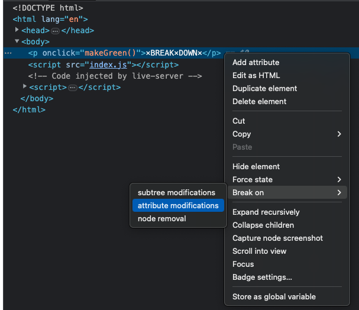
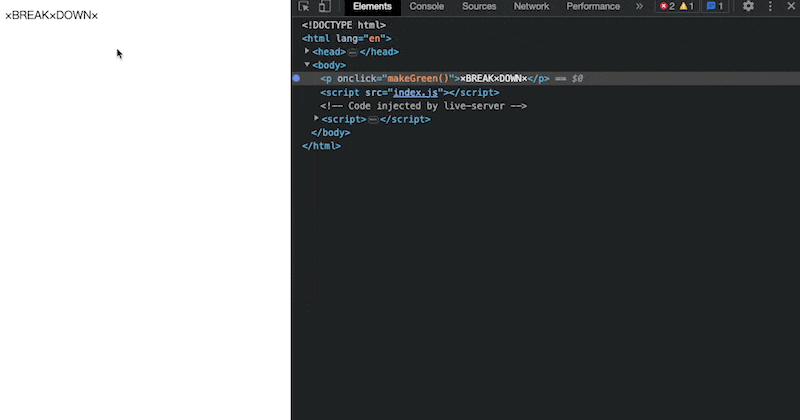
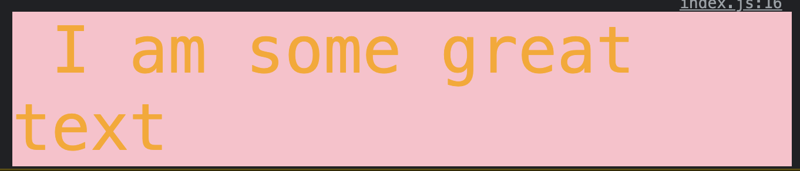
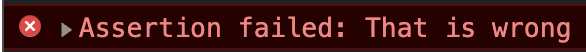
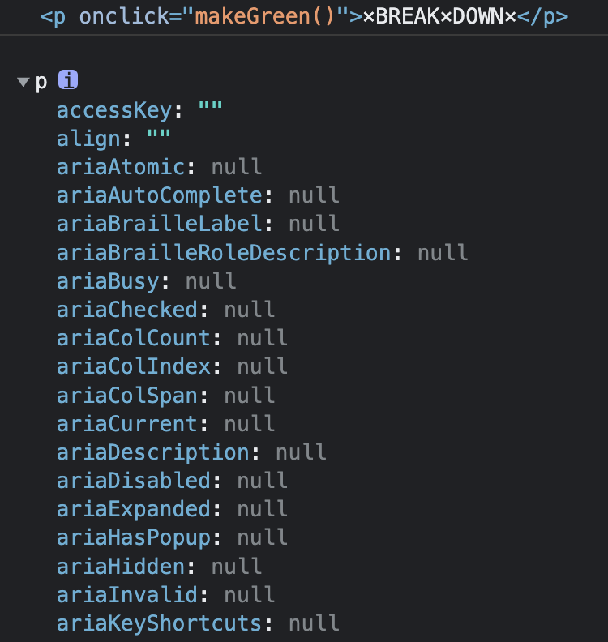
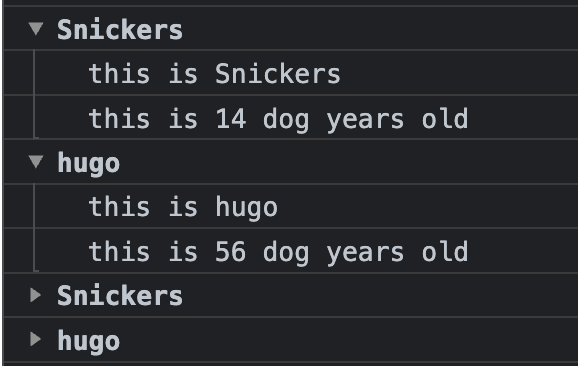
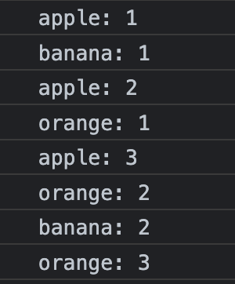
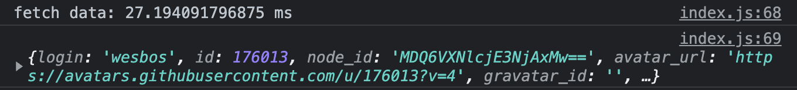

## console

### what cause JavaScript run
```
function makeGreen() {
  const p = document.querySelector('p');
  p.style.color = '#BADA55';
  p.style.fontSize = '50px';
}
```
打開開發者工具，從HTML找到DOM節點，選attribute modifications

p tag會出現一個圓點，點擊文字會觸發onClick事件，執行makeGreen()，可以觀察到執行的時候發生什麼事



### Interpolated : %s
```
console.log('Hello I am a %s string!', '🥹')
```

### Styled : %c
```
console.log('%c I am some great text','color: orange; font-size:50px;background:pink')
```



### Warning!
```
console.warn('OH NO')
```

### Error :|
```
console.error('error message')
```

### Info
```
console.info('crocodiles eat 3-4 people per year')
```

### Testing
如果輸入 1 === 1 ，不會顯示任何字，錯誤的才會
```
console.assert( 1 === 2, 'That is wrong')
```



### clearing
```
console.clear()
```

### Viewing DOM Elements
console.dir 會回傳可查看的內容
```
const p = document.querySelector('p')
console.log(p)
console.dir(p)
```


### Grouping together
Group 
```
const dogs = [{ name: 'Snickers', age: 2 }, { name: 'hugo', age: 8 }];

dogs.forEach( dog => {
  console.group(`${dog.name}`)
  console.log(`this is ${dog.name}`)
  console.log(`this is ${dog.age * 7} dog years old`)
  console.groupEnd(`${dog.name}`)
})
```

GroupCollapsed
呈現出來的是toggle，可以開關
```
dogs.forEach( dog => {
  console.groupCollapsed(`${dog.name}`)
  console.log(`this is ${dog.name}`)
  console.log(`this is ${dog.age * 7} dog years old`)
  console.groupEnd(`${dog.name}`)
})
```



### counting
```
console.count('apple')
console.count('banana')
console.count('apple')
console.count('orange')
console.count('apple')
console.count('orange')
console.count('banana')
console.count('orange')
```


### timing
```
console.time('fetch data')
fetch('http://api.github.com/users/wesbos')
  .then( data => data.json())
  .then(data => {
    console.timeEnd('fetch data')
    console.log(data)
  })
```

