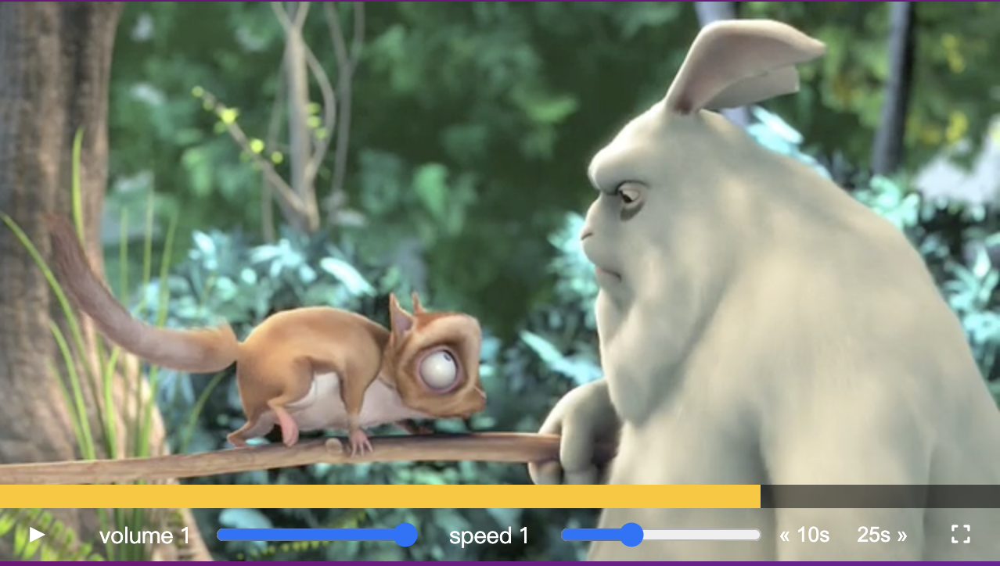

刻一個影片播放器，有音量、速度、快轉25sec、倒轉10sec的功能。


藉此練習了解video屬性，額外添加全螢幕功能，不過到了全螢幕模式，事件監聽就失效了，靠瀏覽器內建好的功能在運作的

## video屬性
video tag 可用來播放影片或影音串流
```html
<video class="player__video viewer" src="./652333414.mp4"></video>
```
用到的屬性
- [video.paused](https://developer.mozilla.org/en-US/docs/Web/API/HTMLMediaElement/paused)
- [video.currentTime](https://developer.mozilla.org/en-US/docs/Web/API/HTMLMediaElement/currentTime)
- [video.duration](https://developer.mozilla.org/en-US/docs/Web/API/HTMLMediaElement/duration)


## 事件監聽

### 影片

video需要對以下事件進行監聽
1. click
2. play: 當paused屬性由true轉換false為時觸發生play事件，事件觸發生原因一般為play()方法調整使用
3. pause: 當pause事件觸發，並且媒體進入暫停狀態，最常見的是通過pause()方法來觸發。當pause()觸發時的pause狀態只映射pause變true。
4. timeupdate: 當currentTime更新時會觸發timeupdate事件

```javascript
video.addEventListener('click',togglePlay)
video.addEventListener('play',updateButton)
video.addEventListener('pause',updateButton)
video.addEventListener('timeupdate',handleProgress)
```

### input range
對input（volume和speed）監聽，有change和mousemove事件，來拿到更新後的值
change事件：當用戶更改`<input>、<select>、<textarea>`元素的value時，change事件在這些元素上觸發。
```javascript
ranges.forEach(range => range.addEventListener('change',handleRangeUpdate))
ranges.forEach(range => range.addEventListener('mousemove',handleRangeUpdate))
```
### progress
```javascript
let mousedown = false
progress.addEventListener('click',scrub)
progress.addEventListener('mousemove', () => {
  if (mousedown) {
    scrub()
  }
})
progress.addEventListener('mousemove', (e) => mousedown && scrub(e))

progress.addEventListener('mousedown',() => mousedown = true)
progress.addEventListener('mouseup',() => mousedown = false)
```
趁這個機會整理一下mouse事件

- mousemove 事件會在滑鼠移動時觸發，通常用於追蹤滑鼠的位置並執行一些相關操作。例如，簡單的拖曳功能或在畫布上繪製圖形。
- mousedown 事件會在滑鼠按下按鈕時觸發。通常用於捕捉滑鼠點擊的開始位置並執行一些相關操作。例如，啟動一個拖曳操作或者開始繪製一個形狀。
- mouseup 事件會在滑鼠放開按鈕時觸發，通常用於捕捉滑鼠點擊的結束位置並執行一些相關操作。例如，使用 mouseup 事件來完成一個拖曳操作或者完成一個繪製的形狀。

跟day 8的畫圖很像，設定一個flag variable 來控制 true / false，讓進度條可以透過點擊某個位置或透過拖曳，來更新當前影片時間
1. 當進度條被點擊時，直接觸發scrub()
2. 當mousemove滑鼠移動事件發生時，注意此時的mousedown 要等於 true，才可以執行scrub()，更新progress的currentTime
3. 當mousedown 事件觸發，讓mousedown屬性 = true
4. 當mouseup 事件觸發，讓mousedown屬性 = false

蠻酷的是，要讓進度條跟著動的原來是透過設定 flexBasis style 
```javascript
function handleProgress(){
  const percent = (video.currentTime / video.duration) * 100
  progressBar.style.flexBasis = `${percent}%`
}
```

### 快轉與倒退
```javascript
skipButtons.forEach( button => button.addEventListener('click',skip))
```
HTML用dataset的方式加上要快轉和倒轉的秒數
```html
<button data-skip="-10" class="player__button">« 10s</button>
<button data-skip="25" class="player__button">25s »</button>
```

要取出dataset時，要記得取出的值都是字串，一定要換成數字
```javascript
function skip(e){
  video.currentTime += parseFloat(e.target.dataset.skip)
}
```

### 全螢幕模式
看多蠻多資訊，都提到有內建好的機制，對不同的瀏覽器設定
進到全螢幕後，可透過ESC或icon 離開全螢幕
```javascript
fullScreenBtn.addEventListener('click',openFullScreen)

function openFullScreen(){
  if (video.requestFullscreen) {
    video.requestFullscreen();
  } else if (video.mozRequestFullScreen) {
    video.mozRequestFullScreen();
  } else if (video.webkitRequestFullscreen) {
    video.webkitRequestFullscreen();
  } else if (video.msRequestFullscreen) { 
    video.msRequestFullscreen();
  }
}
```

參考
[How TO - Fullscreen](https://www.w3schools.com/howto/howto_js_fullscreen.asp)
[Vanilla JavaScript Fullscreen Video](https://daily-dev-tips.com/posts/vanilla-javascript-fullscreen-video/)