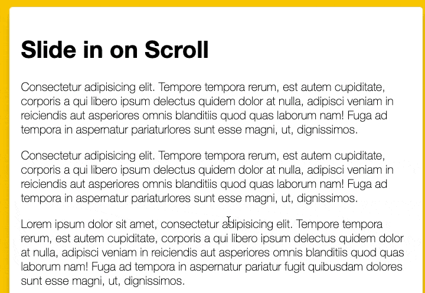

透過滑動scroll來載入圖片



### 兩種達成方式
作者本身是使用高度來計算圖片是否出現在螢幕上，再載入圖片，
在一篇文章 [IntersectionObserver：上篇 – 基本介紹及使用](https://www.letswrite.tw/intersection-oserver-basic/) 中了解到另一個方法，還有觀看影片[Fade and scroll items into view while scrolling](https://www.youtube.com/watch?v=huVJW23JHKQ)，發現另一個方法，使用IntersectionObserver 這個 API。

可以參考[MDN](https://developer.mozilla.org/zh-CN/docs/Web/API/Intersection_Observer_API)

我選擇方法二，因為方法一的方式感覺比較麻煩，要持續監聽畫面且要計算高度才能達成，而方法二是觀察元素是否進入畫面中，有一種0和1的概念，我認為實施上比較簡易，只是要深入去理解觀念

### IntersectionObserver
IntersectionObserver API，可以監聽一個 HTML 元素是否出現在 viewport 內


宣告了 appearOptions 的物件，裡面有 `threshold` 和 `rootMargin` 兩個屬性

- threshold: 0 代表元素的任何部分出現在 viewport 內都會觸發 IntersectionObserver 的回呼函式
- rootMargin 是一個用來設定觀察目標與 root 元素交叉時， root 元素的邊界值的一個選項。它是一個字符串，包含四個數值，分別代表上、右、下、左四個邊距離。這四個值可以是任何帶有度量單位的數值，例如：px、em、rem、% 等等。
    - rootMargin 的值設為 -150px 則代表當元素底部進入 viewport 底部上方 150px 時，觸發callback。
```javascript
const appearOptions = {
  threshold: 0,
  rootMargin: "0px 0px -150px 0px"
};
```
---
建立觀察器（observer），官方語法
```javascript
let options = {
  root: document.querySelector('#scrollArea'),
  rootMargin: '0px',
  threshold: 1.0
}

let observer = new IntersectionObserver(callback, options);
```
範例中寫法：
```javascript
const appearOnScroll = new IntersectionObserver(function(
  entries,
  appearOnScroll
) {...}
```

宣告一個 `appearOnScroll` 的 `IntersectionObserver `實例，設定了回呼函式，函式會接收一個 entries 的參數，代表被觸發的元素，還有一個 appearOnScroll 參數，代表 IntersectionObserver 的實例本身。在callback 裡，使用了 forEach 迴圈遍歷所有的 entries，對每個被觸發的元素進行處理。

appearOptions這個物件用來指定 observer 要監視的目標元素在什麼情況下算作是「進入了 viewport」，從而觸發相應的回調函數。

如果照片進入到觀察範圍，entry.isIntersecting 就會是true，加上active class name，並停止觀察

```javascript
const appearOnScroll = new IntersectionObserver(function(
  entries,
  appearOnScroll
) {
  entries.forEach(entry => {
    if (!entry.isIntersecting) {
      return;
    } else {
      entry.target.classList.add("active");
      appearOnScroll.unobserve(entry.target);
    }
  });
},
appearOptions);
```

使用 forEach() 迴圈遍歷 sliderImages 陣列中的每一個元素，並對每個元素建立一個 IntersectionObserver 的實例 appearOnScroll。
呼叫 observe() 方法來觀察當前元素，即當元素進入可見範圍時，會觸發 appearOnScroll 實例中的回呼函式。
就可以監聽每個元素的出現事件並添加對應的動畫或效果，實現滾動時元素的動畫效果。
```javascript
sliderImages.forEach( sliderImage => {
  appearOnScroll.observe(sliderImage)
})
```