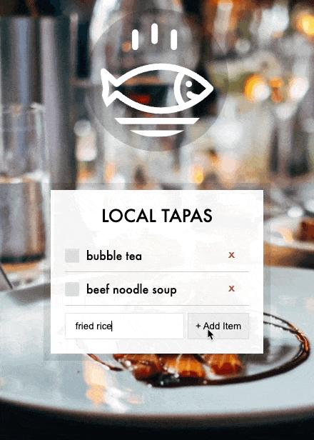
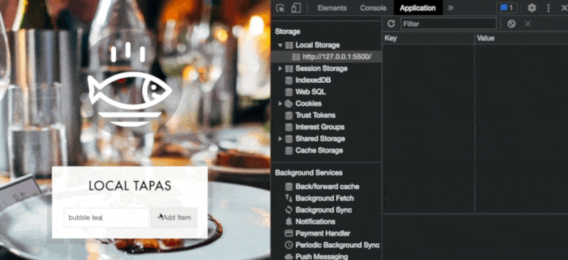
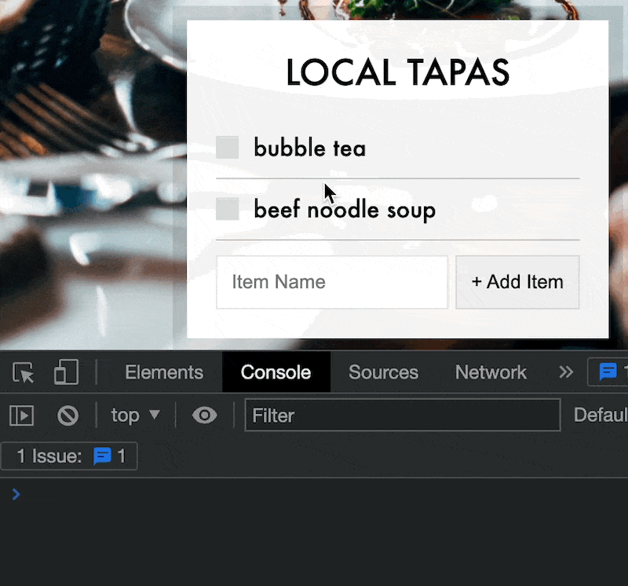

建立可以自行輸入的清單，並儲存在localStorage
==


## display data
第一步驟先讓我們可以輸入文字，並顯示在清單上，建立空陣列儲存在items裡面，對add-items監聽submit事件（HTML為form格式就可以用submit）

1. addItem 函數負責取得輸入的文字，並進一步處理成物件item，接著將item push到items陣列

2. 防呆：如果輸入空格不能送出表單
```javascript
  const target = e.target.firstElementChild.value.trim()
  if (target.length === 0) {
    alert ('內容不能為空白')
    return
  }
```

3. 作者在定義text 輸入字時是使用
`const text = (this.querySelector('[name=item]')).value`
我是用`const text = target` 取出值
4. renderList函數會有兩個參數，第一個是蒐集到的items，第二個是itemsList，會是我們的清單
5. 被呼叫後，會執行map把資料迭代出來，產生出我們定義的HTML，這裡定義的data-index是為了等等要處理localStorage時做準備的
6. 作者使用`this.reset()` 清除輸入的資料，
我使用`e.target.firstElementChild.value = ''`
```javascript
const itemsList = document.querySelector('.plates')
const addItems = document.querySelector('.add-items')

const items = []

addItems.addEventListener('submit', addItem)
renderList(items, itemsList);

function addItem (e) {
  e.preventDefault()
  const target = e.target.firstElementChild.value.trim()
  if (target.length === 0) {
    alert ('內容不能為空白')
    return
  }
  const text = target
  const item = {
    text: text,
    done: false
  }

  items.push(item)
  renderList(items, itemsList)
    
  localStorage.setItem('items',JSON.stringify(items))
    
  e.target.firstElementChild.value = ''
}

function renderList (plates = [], platesList) {
  platesList.innerHTML = plates.map((plate, i) => {
    return `
    <li>
      <input type="checkbox" data-index=${i} id=item${i} ${plate.done? 'checked' : ''}>
      <label for=item${i}>${plate.text}</label>
    </li>
  `
  }).join('')

}
```


## LocalStorage
LocalStorage 是一個有5MB的暫存空間，可以儲存資料，但要把資料放進localStorage時，記得要將資料轉換成字串
打開開發工具後，選擇Application，
- setItem ：命名localStorage為items，用`JSON.stringify`把物件 items轉換成字串
`localStorage.setItem('items',JSON.stringify(items))`

- getItem : 拿出資料，拿出時用`JSON.parse`將字串再轉回物件格式
`const items = JSON.parse(localStorage.getItem('items'))`

- removeItem : 輸入要移除的localStorage名稱就好
` localStorage.removeItem('items'))`

放資料進local storage，Key是我們命名的名字items，Value是我們放進去的資料items


### render localStorage data

順利儲存資料後，要怎麼讓頁面渲染時拿到資料，在全域環境呼叫`renderList(items, itemsList)`，傳入參數，但一開始的 items 我們設為空陣列，這裡要做更動，改為
`const items = JSON.parse(localStorage.getItem('items')) || []`
預設先去localStorage裡面找items，如果沒有找到，那items就是[ ]陣列

```javascript
const items = JSON.parse(localStorage.getItem('items')) || []
renderList(items, itemsList);
```

這樣就可以正確的拿到資料，重新整理後，輸入好的資料也不會消失
### 處理 checkbox done/ false

目前輸入的資料已經可以正確被記錄在localStorage，但物件的屬性done還沒有處理

這裡就使用到剛剛定義好的data-index，透過點擊時拿到的target，可以知道我們點擊的是id 幾號，並對他修改done的true or false
`console.log(index)`


```javascript
itemsList.addEventListener('click',toggleDone)

function toggleDone(e) {
  if (!e.target.matches('input')) return

  const index = e.target.dataset.index
  items[index].done = !items[index].done
  localStorage.setItem('items',JSON.stringify(items))
  renderList(items, itemsList)
}
```

只要資料有變動，除了要存入localStorage，還要重新呼叫renderList函數，讓畫面更新

## 延伸 

### 希望滾軸自動到最下面
當資料變多時，一直新增項目，整個高度會越來越長，所以調整了清單的max-height，把多出來的 `overflow: scroll;` ，製作簡單的scrollbar

調整renderList函數，計算高度
```javascript
function renderList (plates = [], platesList) {
  platesList.innerHTML = plates.map((plate, i) => {
    return `
    <li>
      <input type="checkbox" data-index=${i} id=item${i} ${plate.done? 'checked' : ''}>
      <label for=item${i}>${plate.text}</label>
    </li>
  `
  }).join('')

  platesList.scrollTop = platesList.scrollHeight - platesList.offsetHeight;
}
```

當items 持續被新增，項目越多時，會超出預設高度250px，可以使用 scrollTop 和 scrollHeight 屬性以及 offsetHeight 方法來控制滾動條的位置。

scrollTop ：元素的垂直滾動量。
scrollHeight 是元素內容區塊的完整高度，包括不可見的內容區域。
offsetHeight 是元素在螢幕上所佔據的總高度，包括元素的 padding、border 和 margin 部分，最多到max-width設定值的250px。


例如，如果將滾動條拖到ＬList頂部，則 scrollTop 的值為 0，如果使用者將滾動條拖到列表底部，則 scrollTop 的值等於 scrollHeight - offsetHeight。

所以將 scrollTop 屬性設定為列表的完整高度減去列表在螢幕上所佔據的高度，以將滾動條位置移動到底部，這樣新增的項目後，我們也能直接看到最下方的項目。

#### 透過console.log觀察
```javascript
function renderList (plates = [], platesList) {
  platesList.innerHTML = plates.map((plate, i) => {
    return `
    <li>
      <input type="checkbox" data-index=${i} id=item${i} ${plate.done? 'checked' : ''}>
      <label for=item${i}>${plate.text}</label>
    </li>
  `
  }).join('')
  console.log('items數量：',plates.length)
  console.log('platesList.scrollTop',platesList.scrollTop)
  console.log('platesList.scrollHeight',platesList.scrollHeight)
  console.log('platesList.offsetHeight',platesList.offsetHeight)
  console.log('platesList.scrollTop=',platesList.scrollHeight - platesList.offsetHeight)
  platesList.scrollTop = platesList.scrollHeight - platesList.offsetHeight;
}
```


## delete功能
只要想要對特定的項目做處理，一定要有id之類的唯一值數行才可以，
所以在刪除按鈕的HTML時，一樣要加上`<span data-index=${i} class="delete">x</span>`
```javascript
itemsList.addEventListener('click',deleteItem)

function deleteItem(e) {
  if (e.target.matches('.delete')) {
    const index = e.target.dataset.index
    items.splice(index,1)
    localStorage.setItem('items',JSON.stringify(items))
    renderList(items, itemsList)
  }
}
```

