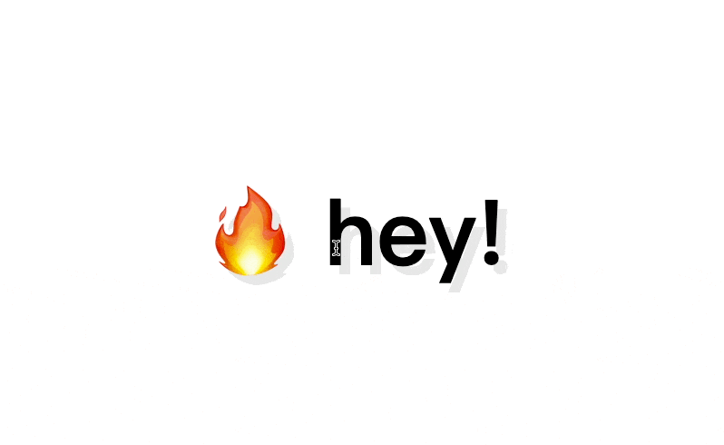

觸發mousemove 滑鼠移動事件時，有文字陰影效果
==


## 設定事件
用解構的方式直接使用width、heigth

shadow函數會拿到hero元素的`offsetWidth`和`offsetHeight`，並存在`width`和`height`變數中。

透過mousemove事件的`offsetX`和`offsetY`，將其存在`x`和`y`變數中。
```javascript
const hero = document.querySelector('.hero')
const text = document.querySelector('h1')

hero.addEventListener('mousemove', shadow)

function shadow(event) {
  // const width = hero.offsetWidth
  // const height = hero.offsetHeight
  const {offsetWidth: width, offsetHeight: height} = hero
  let { offsetX: x, offsetY: y} = event
}

```

### offset
`offsetLeft`、 `offsetTop`、`offsetWidth`、`offsetHeight` 是 Element 的屬性
`offsetX` 和 `offsetY` 是 Mouse Event 的屬性。

## 定義條件來觸發陰影
移動滑鼠時，會發現移到h1 tag裡面時，x, y 值會從三位數跳動到一位數


所以要設定一個條件，`if ( this !== event.target)`，表示要`e.target === h1`，調整座標計算
this代表的是呼叫事件監聽的hero，target會隨著我們點擊不同的元素有不同的回應

shadow 函數中的 x 和 y 是滑鼠在 hero 元素上的相對位置。但如果滑鼠不在 hero 元素上，而是在 hero 元素的`<h1>`元素上，那麼 x 和 y 的值就是相對於`<h1>`元素的位置，而不是相對於 hero 元素的位置。

為了解決這個問題，我們需要把 x 和 y 的值加上`<h1>`元素與 hero 元素的距離，這就是 event.target.offsetLeft 和 event.target.offsetTop 的作用。


接著根據數值改變 textShadow 陰影大小範圍，
以 text 為中心點

- `(x / width)` 可以取得當前滑鼠 x 在 width 的百分比，此時原點在畫面左上角
- `(x / width * walk) - (walk /2)` 可以讓原點變成在畫面中心


```javascript
const walk = 300 

function shadow(event) {
  // const width = hero.offsetWidth
  // const height = hero.offsetHeight
  const {offsetWidth: width, offsetHeight: height} = hero
  let { offsetX: x, offsetY: y} = event
  console.log('x y:',x, y)
    
  if ( this !== event.target) {
    x = x + event.target.offsetLeft
    y = y + event.target.offsetTop
  }
  console.log('x y:',x, y)
  // how far the text shadow should actually go 
  const xWalk = Math.round((x / width * walk) - (walk /2))
  const yWalk = Math.round((y / height * walk) - (walk /2))
  console.log('xWalk yWalk', xWalk,yWalk)
}
```

## 設計陰影變化
```javascript
/* offset-x | offset-y | blur-radius | color */
text-shadow: 1px 1px 2px black;
```

```javascript
function shadow(event) {
  // ...
    
  text.style.textShadow = `
    ${xWalk}px ${yWalk}px 0 rgba(255,0,255,0.7),
    ${xWalk * -1}px ${yWalk}px 0 rgba(0,255,255,0.7),
    ${yWalk}px ${xWalk * -1}px 0 rgba(0,255,0,0.7),
    ${yWalk * -1}px ${xWalk}px 0 rgba(0,0,255,0.7)
  `
}
```


參考 [Day16: CSS Text Shadow Mouse Move Effect](https://pjchender.dev/js30/js30-day16/)