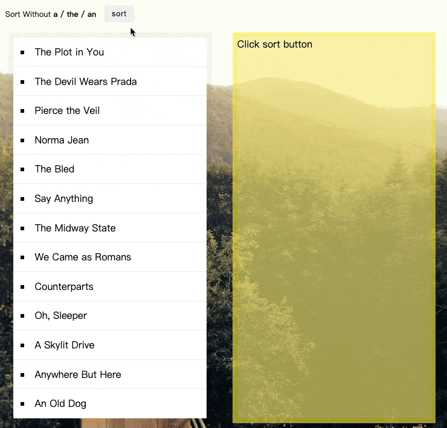

練習使用sort，過濾關鍵字後再排序
==


## 了解sort用法
越大的越後面

三元運算子寫法（採用這個寫法）
```javascript
function sortList() {
  const sortedBands = bands.sort(function(a,b) {
    return a > b ? 1 : -1
  })
```
## 排序時過濾掉某些字元

作者使用正則表達，期望在排序時過濾 `a|the|an` 字串，要注意`/^(a |the |an )/i`的空格也很重要，寫錯會回傳不同的結果
```javascript
function strip(bandName) {
  return bandName.replace(/^(a |the |an )/i, '').trim()
}
```
利用選擇器，遍歷所有`bands`
```javascript
document.querySelector('#bands').innerHTML = bands.map(band => {
  return `<li>${band}</li>`
}).join('')
```
記得要加`join('')``，去除 ,

### 延伸： 點擊sort按鈕，出現新的排序
監聽click事件，再點擊後出現新的排序

```javascript
const sortBtn = document.querySelector('.action')
sortBtn.addEventListener('click',sortList)
  
  document.querySelector('.bands').innerHTML = sortedBands.map(band => {
  return `<li>${band}</li>`
  }).join('')
  
}
```