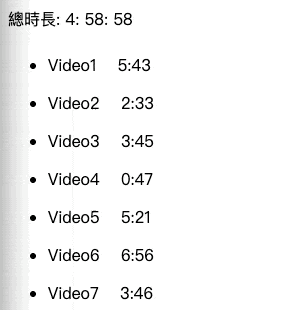
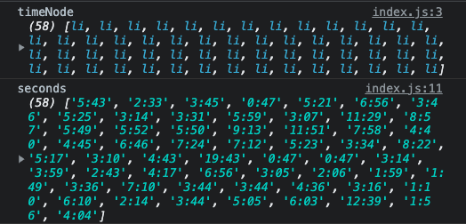
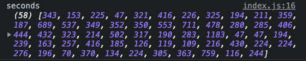

對影片的時間進行累加，再換算成時：分：秒
==



## map出每個影片時間
加總影片的總時長，HTML有`<li data-time="1:56">`的時間資訊，要注意的是dataset的屬性都是字串，要轉換成數字型別


```javascript
const timeNode = document.querySelectorAll('[data-time]')

console.log(timeNode)
```
回傳有58筆資料的NodeList給我們，NodeList只能使用forEach，無法使用map方法，所以我們要把NodeList轉成array

複習一下之前學到的兩種方式
1. ES6 spread
```javascript
const timeNode = [...document.querySelectorAll('[data-time]')]
```

2. Array.from
```javascript
const timeNode = Array.from(document.querySelectorAll('[data-time]'))
```
宣告seconds變數，將 timeNode進行map，取出所有的data-time
```javascript
const seconds = timeNode
.map( node => {
  return node.dataset.time
})

console.log(seconds)
```


## 計算所有影片的總秒數
取出node.dataset.time後，接著對分和秒進行map，這裡用解構的方式取出`[mins, secs]`
```javascript
const seconds = timeNode
.map( node => {
  return node.dataset.time
})
.map( timeCode => {
  // destructure
  const [mins, secs] = timeCode.split(':')
  console.log(mins,secs)
})
```

因為都是字串，我們要先轉換成數字，再把它們轉成秒數
利用`.map(parseFloat)`，將每一個字串轉換數字
```javascript
const seconds = timeNode
.map( node => {
  return node.dataset.time
})
.map( timeCode => {
  // destructure
  const [mins, secs] = timeCode.split(':').map(parseFloat)
  return (mins * 60) + secs
})
```


### 計算所有影片的總秒數: reduce
vidSeconds會是前面回傳的`return (mins * 60) + secs`，對陣列裡面的每個值進行累加，我們得到總秒數17938
```javascript
const seconds = timeNode
.map( node => {
  return node.dataset.time
})
.map( timeCode => {
  // destructure
  const [mins, secs] = timeCode.split(':').map(parseFloat)
  console.log(mins,secs)
  return (mins * 60) + secs
})
.reduce((total, vidSecond) => {
  return total + vidSecond
},0)

console.log(seconds) // 17938
```

## 將總秒數換算成時分秒

```javascript
let secondsLeft = seconds
const hours = Math.floor(secondsLeft / 3600)
console.log('hours',hours)

secondsLeft = secondsLeft % 3600

const mins = Math.floor(secondsLeft / 60)
console.log('mins',mins)

secondsLeft = secondsLeft % 60
console.log('hh: mm: ss:',hours, mins, secondsLeft) // 4 58 58
```
